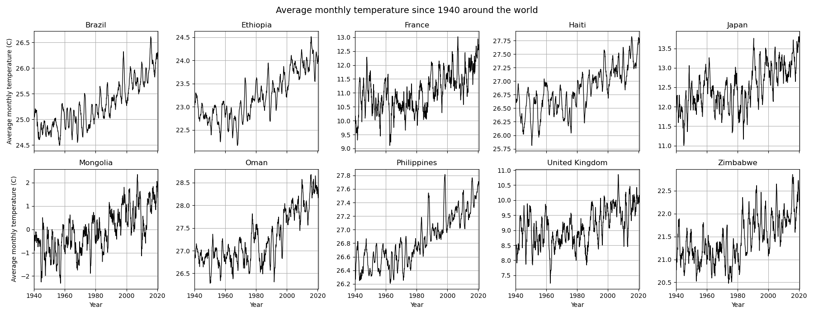

# Global country-average temperature data

Download and create a subset of global country-average temperature data from
[Berkeley Earth](http://berkeleyearth.lbl.gov). This can be used as sample data
for introduction to programming classes.

The selected data cover the same time period with no gaps (NaNs). This will
help make them more accessible to learners. The year and month have been
converted to a decimal year to that they can be easily plotted.

A total of 10 countries were chosen to make it a relatively even spread across
the globe and have both large continental areas as well as island nations.

## License

The source code is distributed under the [MIT license](LICENSE.txt).
